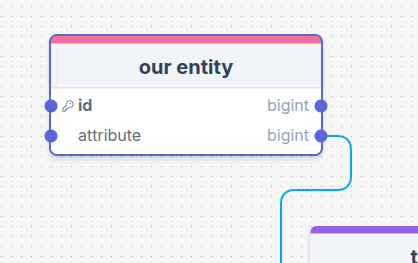
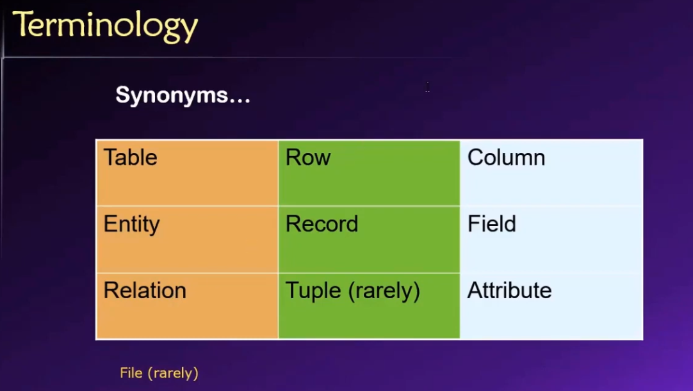
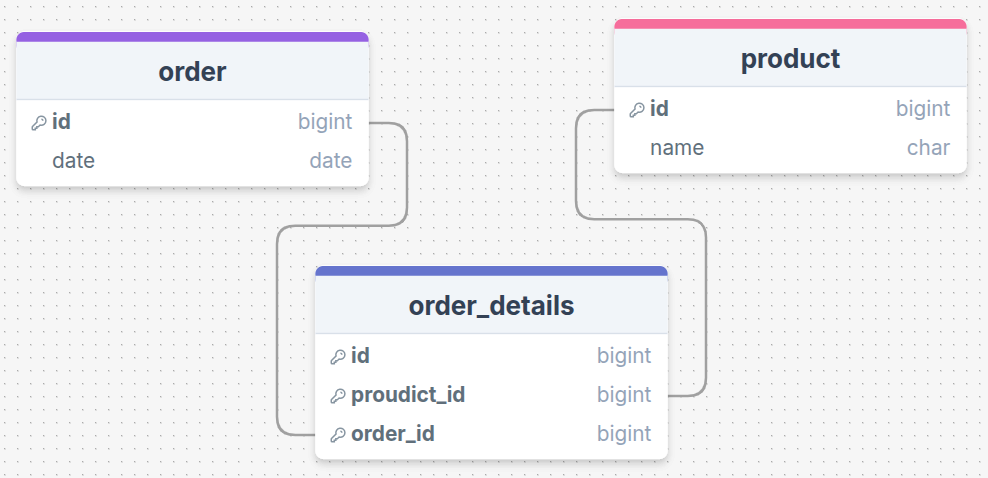
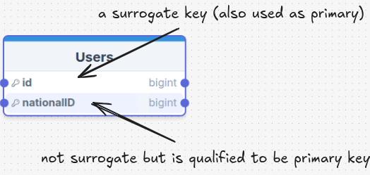

# _Database Design_ course summary

# Topic 01: _INTRODUCTION_

this topic is just an introduction to the Database DEsign course, it breaks ice and sets some vocabulary

## Integrity

- **Data Intergrity** means that data is accurate, consistent, and trustworthy

- **Entity Integrity** each entity (or record) in a database can be uniquely identified, typically using primary keys.

- **Referentaiol Inegrity** elationships between tables (or entities) in a database remain valid. It guarantees that foreign keys match valid primary keys in other tables.

- **Domain Integrity** data entries in a database or system are of the correct type, format, or range, according to the rules or constraints defined for that field or column.

that's it

# Topic 02: _THE RELATIONAL MODEL_

this part sets foundational concepts that the rest of the course will be built on

## Entity

an **Entity** is the thing that we are describing to the Database in form of table -- for example -

an **Entity** has **Attribute** and these attributes are represented by **Colomns**

for illustration


## Termonologies

this part discusses some termonologies and they are basicly are these in this image down below



- an entire **row** represents and instance of an entity, it is also called **Record**

- a **colomn** is a field in the view of the record, so a record has _fields_ which are actually colonms, and they are also attributes in the view of the _Entity_

## Keys

there are two main types of keys

- **unique keys** that are unique over the table and repeating them will cause an error

- **non-unique keys** which can be repeated in a table

the point of a _key_ is to identify a row, any row can hold values but when refering to a specific row, we must have a refrence to that row, that is what keys do

## Composite key

mixing two colomns to make a _unique key_

this is how it is done

```SQL
CREATE TABLE Orders (
    OrderID INT PRIMARY KEY,
    OrderDate DATE
);

CREATE TABLE Products (
    ProductID INT PRIMARY KEY,
    ProductName VARCHAR(100)
);

CREATE TABLE OrderDetails (
    OrderID INT,
    ProductID INT,
    Quantity INT,
    PRIMARY KEY (OrderID, ProductID),  -- Composite key made of foreign keys
    FOREIGN KEY (OrderID) REFERENCES Orders(OrderID),
    FOREIGN KEY (ProductID) REFERENCES Products(ProductID)
);
```

an order might have multiple products and a product might be mentioned in multiple orders, if you want to do an operation on a product that lives in a specific order then composite key are useful



and example SELECT would be like

```SQL
SELECT
    Products.ProductName,
    OrderDetails.Quantity,
    Orders.OrderDate
FROM
    OrderDetails
JOIN
    Products ON OrderDetails.ProductID = Products.ProductID
JOIN
    Orders ON OrderDetails.OrderID = Orders.OrderID
WHERE
    Orders.OrderID = 1001 AND Products.ProductID = 19
```

so nothing really changed in the SELECT statement, but what has actually changed is the fact that there will never ever river be an order with id 1001 with a product 19 in our table again and this gives some profits

- it improves security as no one can insert anymore misleading orders

- it improves consistency as orders wont ever duplicate

- it states the an order is always unique of it's product so developers will recognize this pattern

## Candidate key

a unique key that can be used as a primary key but is has some conditions

- it must be unique, two or more rows in the ssame tabel mustnt have the same value of thar attribute

- it must be there, evey row should have this field no-empety (or NULL)

- it must be consistent, it is not going to be removed or changed (that is why emails doesn't always fit in here)

## NULL

In databases, `NULL` represents the absence of a value or the unknown value. It's used to signify that a particular data field doesn't have any valid or meaningful data. It’s not the same as an empty string, zero, or any other value—it specifically means "no value" or "not applicable."

### Behaviors of `NULL` in Databases:

1. **Cannot Be Compared with Other Values**:

   - `NULL` is not equal to any other value, including another `NULL`. For example, `NULL = NULL` does **not** return `TRUE`; it returns `UNKNOWN`.
   - To check for `NULL`, you use specific operators like `IS NULL` or `IS NOT NULL`, instead of `=` or `!=`.

2. **Effect on Aggregate Functions**:

   - Most aggregate functions (like `COUNT`, `SUM`, `AVG`) ignore `NULL` values. For example, when calculating the sum, `NULL` values are not considered.
   - However, `COUNT(*)` includes `NULL`s because it counts rows, not values.

3. **Arithmetic with `NULL`**:

   - Any operation involving `NULL` typically results in `NULL`. For example, `NULL + 5` will result in `NULL`.
   - This is because `NULL` signifies an unknown value, and performing operations with an unknown value is inherently uncertain.

4. **Behavior in SQL Queries**:

   - When filtering or joining tables, conditions like `WHERE column_name IS NULL` are used to filter out rows where the value is unknown.
   - If you want to check for non-`NULL` values, you use `IS NOT NULL`.

5. **Default Value**:

   - Many databases will allow columns to have `NULL` as a default value if no other value is provided when inserting data. Some databases may allow you to define constraints to prevent `NULL` values in certain columns.

6. **Data Type Compatibility**:
   - `NULL` can be stored in any column, regardless of the column's data type. However, operations involving `NULL` may be restricted depending on the data type or the context.

### Example:

Suppose you have a table of users, with one column for "email address" that allows `NULL`:

```sql
CREATE TABLE users (
    id INT,
    email VARCHAR(255) NULL
);
```

If a user does not provide an email, the `email` field for that user will be `NULL`. You can query for users without emails like this:

```sql
SELECT * FROM users WHERE email IS NULL;
```

## Primary and surrogate keys

a primary key is any unique consistent attribute in the table that point to only one record, it can be anything, it can be surrigate key or email or national ID or student ID

a surrogate key on the other hand is a unique key that has nothing to do with the attributes of the row, it is just a unique generated number that can be used to reference and index rows



## Forign keys

keys that reference another key at another table


# Normalization

normalization is improving the usability of a database and it is about normal forms

## Normal Forms

these normal forms are something equivelant to SOLID principles in programming and breaking them breaks data integrity

### 1NF — First Normal Form

(First Normal Form = follow these 5 rules)

#### Rule 1: **Each cell must have only one value**

**Bad Example (violates rule):**

| EmployeeID | Skills            |
| ---------- | ----------------- |
| 1          | Java, Python, SQL |
| 2          | HTML, CSS         |

_Problem: multiple skills crammed into one cell (comma-separated)._

**Refactored (correct way):**

| EmployeeID | Skill  |
| ---------- | ------ |
| 1          | Java   |
| 1          | Python |
| 1          | SQL    |
| 2          | HTML   |
| 2          | CSS    |

_Now, each cell holds only one value._

---

#### Rule 2: **Each record must have a primary key**

**Bad Example (violates rule):**

| Name | Email                |
| ---- | -------------------- |
| John | john@example.com     |
| John | john.smith@email.com |

_Problem: No unique identifier — we can’t tell which "John" is which easily._

**Refactored (correct way):**

| EmployeeID | Name | Email                |
| ---------- | ---- | -------------------- |
| 1          | John | john@example.com     |
| 2          | John | john.smith@email.com |

_Now we have a unique primary key (EmployeeID)._

---

#### Rule 3: **Can't use row order to convey information**

**Bad Example (violates rule):**

| Step Number | Instruction  |
| ----------- | ------------ |
| (row 1)     | Turn on oven |
| (row 2)     | Mix dough    |
| (row 3)     | Bake         |

_Problem: the meaning of "first do this, second do that" is based on the row order._

**Refactored (correct way):**

| StepID | StepNumber | Instruction  |
| ------ | ---------- | ------------ |
| 1      | 1          | Turn on oven |
| 2      | 2          | Mix dough    |
| 3      | 3          | Bake         |

_Now the sequence is explicit by `StepNumber`, not the database row order._

---

#### Rule 4: **Each column must have only one datatype**

**Bad Example (violates rule):**

| ProductID | ProductName | Price         |
| --------- | ----------- | ------------- |
| 1         | TV          | 500           |
| 2         | Laptop      | "Six Hundred" |

_Problem: the `Price` column has mixed datatypes: one number, one string._

**Refactored (correct way):**

| ProductID | ProductName | Price |
| --------- | ----------- | ----- |
| 1         | TV          | 500   |
| 2         | Laptop      | 600   |

_Now, `Price` is consistently numeric (integer)._

---

#### Rule 5: **Each column name must be unique**

**Bad Example (violates rule):**

| ID  | Name | Name       |
| --- | ---- | ---------- |
| 1   | John | HR Manager |
| 2   | Mary | Developer  |

_Problem: Two columns named "Name" — confusing and invalid._

**Refactored (correct way):**

| ID  | EmployeeName | JobTitle   |
| --- | ------------ | ---------- |
| 1   | John         | HR Manager |
| 2   | Mary         | Developer  |

_Now, column names are unique and meaningful._

### NF2

**Definition:**  
A table is in **Second Normal Form (2NF)** if:

- It is already in **1NF**, and
- **All non-primary-key columns** are fully dependent on the **entire** primary key (no partial dependency).

---

#### Rule: no partial dependency on part of a composite key

**Bad Example:**

| OrderID | ProductID | ProductName | Quantity |
| ------- | --------- | ----------- | -------- |
| 1       | 101       | Keyboard    | 2        |
| 1       | 102       | Mouse       | 1        |
| 2       | 101       | Keyboard    | 1        |

_Composite key: (OrderID, ProductID). Problem: `ProductName` depends only on `ProductID`, not on the full (OrderID, ProductID)._

**Refactored:**

**Orders Table:**

| OrderID | ProductID | Quantity |
| ------- | --------- | -------- |
| 1       | 101       | 2        |
| 1       | 102       | 1        |
| 2       | 101       | 1        |

**Products Table:**

| ProductID | ProductName |
| --------- | ----------- |
| 101       | Keyboard    |
| 102       | Mouse       |

_Now, `ProductName` is only in the `Products` table, which depends fully on `ProductID`._

### NF3

---

**Definition:**  
A table is in **Third Normal Form (3NF)** if:

- It is already in **2NF**, and
- **No non-primary-key column depends on another non-primary-key column** (no transitive dependency).

---

#### Rule: no transitive dependency

**Bad Example:**

| EmployeeID | EmployeeName | DepartmentID | DepartmentName |
| ---------- | ------------ | ------------ | -------------- |
| 1          | John         | 10           | HR             |
| 2          | Mary         | 20           | IT             |
| 3          | Steve        | 10           | HR             |

_Problem: `DepartmentName` depends on `DepartmentID`, not directly on `EmployeeID`._

**Refactored:**

**Employees Table:**

| EmployeeID | EmployeeName | DepartmentID |
| ---------- | ------------ | ------------ |
| 1          | John         | 10           |
| 2          | Mary         | 20           |
| 3          | Steve        | 10           |

**Departments Table:**

| DepartmentID | DepartmentName |
| ------------ | -------------- |
| 10           | HR             |
| 20           | IT             |

_Now, every non-key attribute depends only on the key (EmployeeID or DepartmentID directly)._

### NF4

---

**Definition:**  
A table is in **Fourth Normal Form (4NF)** if:

- It is already in **3NF**, and
- It has **no multi-valued dependencies** (one record should not contain two or more independent multi-valued facts about the same entity).

---

#### Rule: no multi-valued dependency

**Bad Example:**

| StudentID | Course  | Hobby    |
| --------- | ------- | -------- |
| 1         | Math    | Football |
| 1         | Science | Football |
| 1         | Math    | Painting |
| 1         | Science | Painting |

_Problem: Courses and Hobbies are independent facts but are combined, leading to unnecessary duplication._

**Refactored:**

**StudentCourses Table:**

| StudentID | Course  |
| --------- | ------- |
| 1         | Math    |
| 1         | Science |

**StudentHobbies Table:**

| StudentID | Hobby    |
| --------- | -------- |
| 1         | Football |
| 1         | Painting |

_Now, Courses and Hobbies are separated into two independent tables._

### NF5

---

**Definition:**  
A table is in **Fifth Normal Form (5NF)** if:

- It is already in **4NF**, and
- It has **no join dependency** that can cause redundant data (the table should be broken down into smaller tables that can be joined without data loss).

---

#### Rule: no unnecessary join dependency

**Bad Example:**

| SupplierID | ProductID | CustomerID |
| ---------- | --------- | ---------- |
| 1          | A         | 100        |
| 1          | B         | 100        |
| 1          | A         | 101        |
| 1          | B         | 101        |

_Problem: Supplier supplies multiple Products to multiple Customers — but this mixes independent relationships, causing redundancy._

**Refactored:**

**SupplierProducts Table:**

| SupplierID | ProductID |
| ---------- | --------- |
| 1          | A         |
| 1          | B         |

**SupplierCustomers Table:**

| SupplierID | CustomerID |
| ---------- | ---------- |
| 1          | 100        |
| 1          | 101        |

**ProductCustomers Table:** (if needed)

| ProductID | CustomerID |
| --------- | ---------- |
| A         | 100        |
| A         | 101        |
| B         | 100        |
| B         | 101        |

_Now, each relationship is represented separately without redundant combinations._

## Refactoring a table from NF0 to NF5

### Starting Messy Table (non-normalized)

| StudentID | StudentName | Courses       | Hobbies       | AdvisorName | AdvisorPhone |
| --------- | ----------- | ------------- | ------------- | ----------- | ------------ |
| 1         | John        | Math, Physics | Chess, Guitar | Dr. Smith   | 123-4567     |
| 2         | Mary        | Chemistry     | Painting      | Dr. Brown   | 987-6543     |

---

### After 1NF (First Normal Form)

- Split multi-values into separate rows.
- Ensure one value per cell.

**Students Table (1NF):**

| StudentID | StudentName | Course    | Hobby    | AdvisorName | AdvisorPhone |
| --------- | ----------- | --------- | -------- | ----------- | ------------ |
| 1         | John        | Math      | Chess    | Dr. Smith   | 123-4567     |
| 1         | John        | Math      | Guitar   | Dr. Smith   | 123-4567     |
| 1         | John        | Physics   | Chess    | Dr. Smith   | 123-4567     |
| 1         | John        | Physics   | Guitar   | Dr. Smith   | 123-4567     |
| 2         | Mary        | Chemistry | Painting | Dr. Brown   | 987-6543     |

---

### After 2NF (Second Normal Form)

- Remove partial dependency (attributes that depend only on part of a composite key).

**Students Table:**

| StudentID | StudentName | AdvisorName | AdvisorPhone |
| --------- | ----------- | ----------- | ------------ |
| 1         | John        | Dr. Smith   | 123-4567     |
| 2         | Mary        | Dr. Brown   | 987-6543     |

**StudentCourses Table:**

| StudentID | Course    |
| --------- | --------- |
| 1         | Math      |
| 1         | Physics   |
| 2         | Chemistry |

**StudentHobbies Table:**

| StudentID | Hobby    |
| --------- | -------- |
| 1         | Chess    |
| 1         | Guitar   |
| 2         | Painting |

---

### After 3NF (Third Normal Form)

- Remove transitive dependency (attributes that depend on non-primary attributes).

**Students Table:**

| StudentID | StudentName | AdvisorID |
| --------- | ----------- | --------- |
| 1         | John        | 1         |
| 2         | Mary        | 2         |

**Advisors Table:**

| AdvisorID | AdvisorName | AdvisorPhone |
| --------- | ----------- | ------------ |
| 1         | Dr. Smith   | 123-4567     |
| 2         | Dr. Brown   | 987-6543     |

**StudentCourses Table:**

(same)

**StudentHobbies Table:**

(same)

---

### After 4NF (Fourth Normal Form)

- Remove multi-valued dependencies (Courses and Hobbies are independent).

Already separated in **StudentCourses** and **StudentHobbies** tables after 2NF.  
No changes needed here — already clean after splitting into separate tables.

---

### After 5NF (Fifth Normal Form)

- Ensure no join dependency issues.
- Validate that all separate facts can reconstruct original relationships without redundancy.

Current tables:

- **Students**
- **Advisors**
- **StudentCourses**
- **StudentHobbies**

They are already properly separated and can be joined back without anomalies.  
No extra changes needed — database is in 5NF.

# Tables

## Lookup Table

the Idea of lokup table is the application of separation of concernd and application of Normal Forms by yelding an entity to another table and only refering to it

### Example:

1. **Order Status Lookup Table**:
   | status_id | status_name |
   |-----------|--------------|
   | 1 | Pending |
   | 2 | Shipped |
   | 3 | Delivered |
   | 4 | Cancelled |

2. **Orders Table**:
   | order_id | customer_id | order_date | status_id |
   |----------|-------------|------------|-----------|
   | 1 | 1001 | 2025-04-25 | 1 |
   | 2 | 1002 | 2025-04-26 | 3 |
